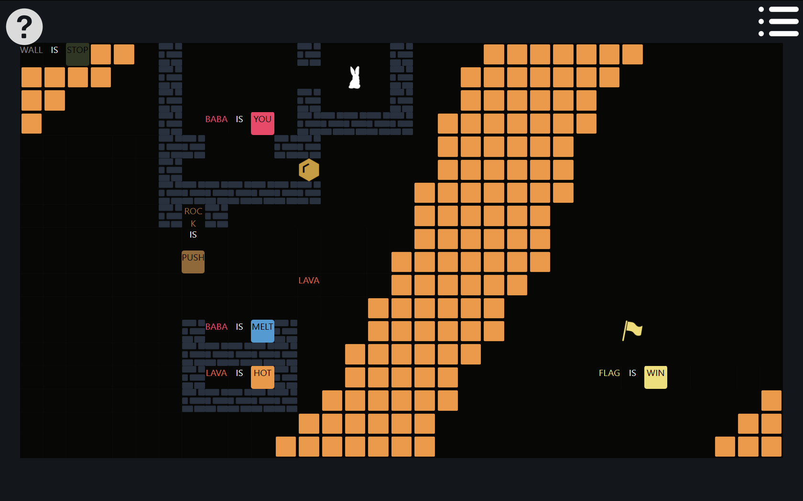
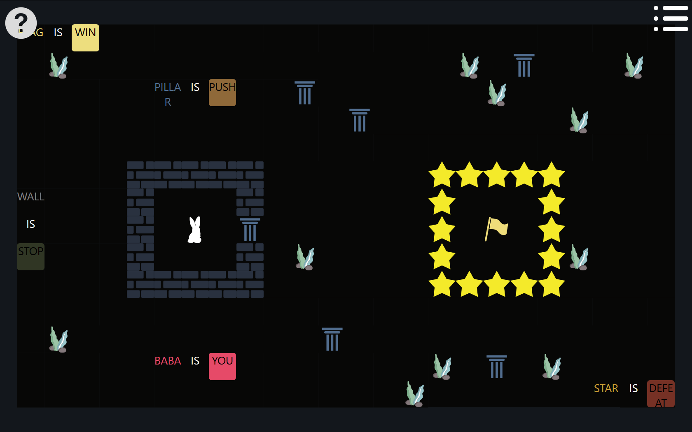

# 粑粑是你

## 项目简介

该项目尝试仿制 baba is you. 制作一个网页版游戏.


## 项目截图






## 编译项目

### 下载项目到本地

点击项目主页中的 `clone or download` 按钮. 将项目下载到本地.


### 安装 node 环境

在 [node官网](https://nodejs.org/zh-cn/) 下载 nodejs 稳定版本, 并安装.

[安装流程参考](https://www.runoob.com/nodejs/nodejs-install-setup.html)


### 编译该项目

打开命令行窗口, 将目录调整到当前项目的根目录.

输入命令:

> npm i

安装项目依赖。

等待安装完成后， 使用命令：

> npm start

项目将进入开发调试模式，打开浏览器并在地址栏输入

> localhost:3000

就可以看见游戏界面（具体端口命令行窗口应该会显示）


## 设计

### 文件结构

待补充


### 逻辑控制

#### 场景

场景是一个不可变数据对象, 其代表游戏中一帧画面. 该游戏的所有操作和渲染都是围绕场景来进行的. 场景的核心有两个:

1. 渲染: 构造一个对于静态场景的渲染函数, 在 `React` 中可以使用函数组件来达成这一目的. 每当有一个场景后, 可以将其渲染到屏幕中.

2. 更新: 场景通过 `moveAll` 来计算出下一场景, 使用下一场景替换当前场景, 重新渲染画面, 游戏这样更新下去了.


场景是由接口 `SceneInterface` 描述的.

在当前的代码中, 使用 `Scene` 作为其一个具体实现.

该实现使用游戏对象的三维数组来存储数据.(`GameObjectInterface[][][]`)

三个维分别表示行, 列, 高(该游戏允许重叠).


#### 移动

使用可配置的 moveAll 实现当前场景的更新操作.

```tsx
const winControl = winBuilder(this.props.onWin)
const control = unionControl(
  youCanMove,
  checkTheBound,
  stopCheck,
  pushThings,
  winControl,
  transformControl,
  sinkControl,
)
const newScene = moveAll(currentScene, control, direction)
```

如上面代码中可以看见 `moveAll` 函数有三个参数:

1. 当前场景
2. 控制器
3. 方向

*后续应该会调整参数的顺序, 或者可能会有科里化*.

控制器是由多个回调函数组成的. 可以监听发生的移动操作, 并触发一下行为.

举例来说, 

`stopCheck` -- 停止检查控制器会在发生移动前`onMoveCheck()`, 判断移动方向上是否有对象有 stop 属性, 如果有, 就拒绝该移动.

直接使用控制器不足以完成复杂的控制操作, 因而提供联合控制器将单独的控制器组合起来使用.


#### 插件

在目前的情况中, 每一个子控制器和总控制器的结构是完全相同的.

总控制器也只是通过简单通过依次调用来协调所有子控制器.

总控制器目前的作用类似于一个USB集线器


将多个支持 USB 的设备汇总到一个 USB 接口上.


下文做以下约定

1. 称 子控制器 为 插件.
2. 称 总控制器 为 控制器.

当然根据日常生活我们也可以认识到, 控制器和插件并不都需要使用相同的接口, 只要它们可以协同工作就好. 在后续的重构计划中, 将可能为插件编写专门的接口.


##### 回调

目前插件有两个主动回调:

```tsx
onStart(context: Context): void
onFinalCheck(context: Context): void
```

onStart 和 onFinalCheck. 

其调用关系是:

1. 所有的插件的 onStart 以原始场景为参数被调用. 调用产生的行为并不立即生效, 而是在所有 onStart 调用结束后, 汇总所有的 onStart 生成一个新的中间场景.

2. onFinalCheck 再以该中间场景为参数调用, 生成最终场景返回.

onStart 和 onFinalCheck 其实都是场景的回调函数, 两者除了调用先后导致的参数值不同外, 没有其他不同之处.


由于生效延迟, 因而所有插件的 onStart 的参数都是一致的, 和调用的顺序没有关系. onFinalCheck 的情况也是相同的.


插件还有两个被动回调:

```tsx
onMoveCheck(context: Context, pos: Position, direction: Direction): boolean
onMove(context: Context, pos: Position, direction: Direction): void
```

其与主动回调的区别是, 主动回调一定会被调用, 而被动回调只有当触发了相应的事件后, 才会被调用.

如 `youCanMove` 插件让所有带有 `you` 属性的对象调用了 move 方法, move 方法会先调用 onMoveCheck 进行检查, 如果通过了检查则调用 onMove 并发起移动 (移动会延迟生效). 

*后续可能会将带有检查的 move 重命名为 safeMove, 并提供一个强制移动称为 unsafeMove 或者 forceMove*


##### 回调的参数

四个回调都有 Context 类型的参数. 而 被动回调 onMoveCheck 多了当前移动的物体的位置, 和移动的方向.

下面着重解释 Context

```tsx
scene: SceneInterface,
rules: Rules
direction: Direction
move: (pos: Position, direction: Direction) => void
moveCheck: (pos: Position, direction: Direction) => boolean
addObj(pos: Position, obj: GameObjectInterface): void
removeObj(pos: Position): void
```

可以看见 Context 中有四个方法和三个数据.

数据为:

1. scene 当前场景对象
2. rules 从场景对象中解析出来的规则对象
3. direction 当前的移动的方向

方法为:

1. move 安全移动, 自带检查的移动操作
2. moveCheck 移动检查
3. addObj 向场景中添加一个对象
4. removeObj 从场景中删除一个对象


*rules 可以从场景中解析出来, 也许应该移动到外面作为 scene 的一个纯函数*


## 后续代办事项

### 功能

1. 实现地图编辑器


### 优化

1. 使用 immuable 减小内存的开销
2. 使用 cache 减小函数重复调用的计算开销